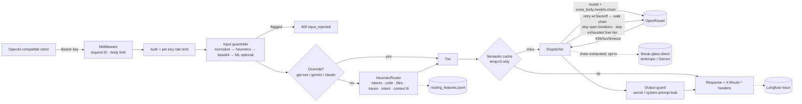

# multi-llm-router-gateway

An OpenAI-compatible gateway that routes each chat request to one of three model tiers
on [OpenRouter](https://openrouter.ai), balancing **cost, latency and safety**:

| Tier | Primary model | OpenRouter-native fallback chain | Typical traffic |
|---|---|---|---|
| SIMPLE | `openai/gpt-oss-20b:free` (free, `reasoning.effort=low`) | `openai/gpt-oss-20b` (paid, same model) → `meta-llama/llama-3.1-8b-instruct` | short chat, utility, extraction |
| INTERMEDIATE | `google/gemini-3.1-pro-preview` | `openai/gpt-oss-20b` | data processing, large-context analysis, medium reasoning |
| COMPLEX | `anthropic/claude-sonnet-5.5` | `google/gemini-3.1-pro-preview` → `openai/gpt-oss-20b` | system architecture, algorithmic code, multi-file debugging |

Features:
- Heuristic three-tier routing with a context-fit check.
- Two-layer fallback: OpenRouter-native `models` plus a gateway-level retry and chain walk.
- Per-model circuit breakers.
- Free-tier quota tracking.
- Prompt-injection guardrails and output leak checks.
- Langfuse tracing that fails open.
- Streaming (SSE), an optional cascade mode and an optional semantic cache.

Design rationale and every unverified assumption: [`docs/DECISIONS.md`](docs/DECISIONS.md).

## Architecture



```
app/
  main.py            FastAPI factory + lifespan (startup checks, tracer flush)
  config.py          pydantic-settings + ModelRegistry
  model_registry.json  tiers, models, prices, context windows, fallbacks, aliases
  models.py          request schemas, Tier, RouteDecision
  service.py         orchestration
  api/               routes, auth/rate limit, ASGI middleware
  routing/           Router protocol, HeuristicRouter, features + JSONL log, overrides, cascade
  llm/               OpenRouter client, dispatcher, circuit breaker, free-tier limiter, errors, pricing, startup
  guardrails/        normalization, heuristic + base64 checks, ML classifier interface, output guard
  observability/     Langfuse tracer, log redaction
  cache/             semantic cache
```

## Setup

Requires [uv](https://docs.astral.sh/uv/) (Python 3.12 is pinned in `.python-version`).

```bash
uv sync --locked              # installs exactly what uv.lock specifies
cp .env.example .env          # then fill in OPENROUTER_API_KEY and GATEWAY_API_KEYS
uv run uvicorn app.main:get_app --factory --port 8000
```

On startup, when `OPENROUTER_API_KEY` is set, the gateway:
1. Calls `GET /api/v1/models` and **fails fast** if any configured model ID is missing. It also syncs context windows and prices from that listing.
2. Calls `GET /api/v1/key` and logs whether the key is free-tier. It warns if `FREE_TIER_DAILY_CAP` doesn't match.

Docker:
```bash
docker build -t multi-llm-router-gateway .
docker run --env-file .env -p 8000:8000 multi-llm-router-gateway
```

Quality gates (same as CI):
```bash
uv run ruff check . && uv run mypy app && uv run pytest --cov=app
```

## Environment variables

| Variable | Default | Purpose |
|---|---|---|
| `OPENROUTER_API_KEY` | – | **Required.** Without it `/readyz` reports 503. |
| `GATEWAY_API_KEYS` | – | Comma-separated client bearer keys. Empty means every request gets 401 (fails closed). |
| `FREE_TIER_DAILY_CAP` / `FREE_TIER_RPM_CAP` | 50 / 20 | Local free-model caps (see below). |
| `FREE_TIER_SEND_GATEWAY_SYSTEM_PROMPT` | false | Send `GATEWAY_SYSTEM_PROMPT` to the free tier (off: free providers may log inputs). |
| `GATEWAY_SYSTEM_PROMPT` | – | Gateway instructions, always sent as a separate `system` message. Protected by the output guard. |
| `RATE_LIMIT_RPM_PER_KEY` / `MAX_BODY_BYTES` | 60 / 1 MB | Per-key rate limit (429) and body limit (413). |
| `RETRY_MAX_ATTEMPTS`, `RETRY_BASE_DELAY_S`, `RETRY_MAX_DELAY_S`, `RETRY_AFTER_CAP_S` | 3, 0.25, 4, 10 | Gateway retry policy per hop. |
| `CIRCUIT_FAILURE_THRESHOLD` / `CIRCUIT_COOLDOWN_S` | 5 / 30 | Per-model circuit breaker. |
| `CONNECT_TIMEOUT_S` / `READ_TIMEOUT_S` / `SDK_MAX_RETRIES` | 5 / 60 / 0 | Upstream timeouts. SDK retries are off so they don't stack with gateway retries. |
| `ROUTING_MODE` | direct | `cascade`: try cheaper tiers first and escalate on empty, refusal or bad JSON. |
| `ENABLE_TRACING`, `LANGFUSE_PUBLIC_KEY`, `LANGFUSE_SECRET_KEY`, `LANGFUSE_BASE_URL` | true | Langfuse SDK v4 (`LANGFUSE_HOST` is accepted as a legacy alias). |
| `TRACE_RAW_CONTENT` / `TRACE_HASH_SALT` | false / "" | Include prompt/completion text in traces; HMAC salt for hashed IDs. |
| `ENABLE_SEMANTIC_CACHE` (+ `SEMANTIC_CACHE_THRESHOLD`, `_TTL_S`, `_MAX_ENTRIES`) | false | Per-key semantic cache, only for `temperature: 0`. |
| `BREAK_GLASS_ENABLED`, `ANTHROPIC_API_KEY`, `BREAK_GLASS_ANTHROPIC_MODEL`, `GEMINI_API_KEY`, `BREAK_GLASS_GEMINI_MODEL` | off | Direct-provider last resort after the whole OpenRouter chain fails. |
| `GUARDRAIL_CLASSIFIER_ENABLED` | false | Llama Prompt Guard 2 via Hugging Face (licence-gated; needs `transformers` and `torch`). |
| `VALIDATE_MODELS_ON_STARTUP` / `SYNC_REGISTRY_FROM_OPENROUTER` | true / true | Startup checks. |
| `MODEL_REGISTRY_PATH` | bundled JSON | Override the model registry file. |
| `ROUTING_FEATURES_LOG_PATH` | `logs/routing_features.jsonl` | Routing features log (no prompt text), used to train a learned router later. |

## Usage

The endpoint is OpenAI-compatible: point any OpenAI SDK at `http://localhost:8000/v1` and use `model: "auto"`.

```bash
# Automatic routing
curl -s http://localhost:8000/v1/chat/completions \
  -H "Authorization: Bearer $GATEWAY_KEY" -H "Content-Type: application/json" \
  -d '{"model":"auto","messages":[{"role":"user","content":"Translate hello to French"}]}' -i

# Response headers:
#   X-Route-Tier: SIMPLE
#   X-Routed-Model: openai/gpt-oss-20b:free   (the model that actually served it)
#   X-Fallback-Used: false
#   X-Free-Tier: true
#   X-Request-ID: 3f2a...
#   X-Degraded: true                          (only when COMPLEX fell back to gpt-oss-20b)

# Manual override (allowlisted aliases only: gpt-oss | gemini | claude)
curl -s http://localhost:8000/v1/chat/completions \
  -H "Authorization: Bearer $GATEWAY_KEY" -H "X-Model-Override: claude" -H "Content-Type: application/json" \
  -d '{"messages":[{"role":"user","content":"Review this design"}]}'

# Streaming (SSE). Fallback applies only before the first token is emitted.
curl -N http://localhost:8000/v1/chat/completions \
  -H "Authorization: Bearer $GATEWAY_KEY" -H "Content-Type: application/json" \
  -d '{"model":"auto","stream":true,"messages":[{"role":"user","content":"Tell me a joke"}]}'

curl -s http://localhost:8000/healthz   # liveness
curl -s http://localhost:8000/readyz    # readiness + breaker states + free-tier counters
```

```python
from openai import OpenAI

client = OpenAI(base_url="http://localhost:8000/v1", api_key="<gateway key>")
resp = client.chat.completions.create(model="auto", messages=[{"role": "user", "content": "hi"}])
```

Errors use the OpenAI shape, `{"error": {"message", "type", "code", "request_id"}}`. The codes are:
`invalid_api_key` (401), `rate_limit_exceeded` (429), `request_too_large` (413),
`invalid_request` / `invalid_model_override` / `input_rejected` (400),
`context_length_exceeded` (413), `upstream_error` (400/502), `output_rejected` (502),
`upstream_unavailable` (503).

## Free-tier limits and how to raise them

OpenRouter's `:free` models allow 20 requests/minute. Daily, they allow **50 requests/day** on an account that has never bought credits, and **1000/day** once you've purchased $10 or more. Failed attempts count against the daily quota.

The gateway handles this in four ways:
- It counts free-model calls per UTC day and per rolling minute, in process.
- It reserves a slot before each call.
- Once either cap is exhausted, it skips the free model and goes straight to paid `openai/gpt-oss-20b`, without spending a request that would 429.
- It never retries a free-model 429; it walks to the paid fallback instead.

**To raise the limits:** add $10+ of credits to your OpenRouter account, then set
`FREE_TIER_DAILY_CAP=1000`. At startup the gateway logs `is_free_tier` from
`GET /api/v1/key` and warns if the cap doesn't match what OpenRouter reports.

## Adding or changing a model

1. Edit `app/model_registry.json`, or point `MODEL_REGISTRY_PATH` at your own copy:
   ```json
   "mistralai/mistral-small": {
     "context_window": 32768, "input_price_per_m": 0.1, "output_price_per_m": 0.3,
     "is_free": false, "fallbacks": ["openai/gpt-oss-20b"]
   }
   ```
2. Point a tier at it (`"tiers": {"INTERMEDIATE": {"model": "mistralai/mistral-small"}}`), add it to another model's `fallbacks`, or add an alias (`"aliases": {"mistral": "INTERMEDIATE"}`).
3. Restart. Startup validation rejects unknown IDs, and syncs context windows and prices from OpenRouter.

Routing logic never hard-codes model IDs. A learned router (RouteLLM-style) can replace `HeuristicRouter` by implementing `Router.classify(request) -> RouteDecision` and training on `logs/routing_features.jsonl`.

## Guardrails

- **Input.** Text is normalized first: NFKC, zero-width and bidi characters stripped, casefolded. Then a pipeline of checks runs:
  1. Heuristic patterns: instruction override, role hijack, system-prompt extraction, chat-template tokens.
  2. Base64 payloads: decoded and re-checked, and oversize blobs rejected.
  3. Optionally, an ML classifier that scores 512-token windows and takes the max.
- **What's rejected.** Flagged requests get a generic 400 `input_rejected`; the matched rule is logged and traced but never returned. Benign phrasing such as "ignore the previous error and fix my function" is covered by false-positive tests.
- **Output.** Responses that contain configured secrets or fragments of the gateway system prompt are withheld with 502 `output_rejected`.

## Observability

Each request produces one Langfuse trace. The root span holds prompt length and token estimate, hashed key/user IDs, the guardrail result, the route decision and reasons, any override, and the cache result. Each upstream attempt becomes a child generation carrying model, status, latency, token usage and estimated cost (cost is 0 for free models). Tracing fails open, and the lifespan flushes it on shutdown.
